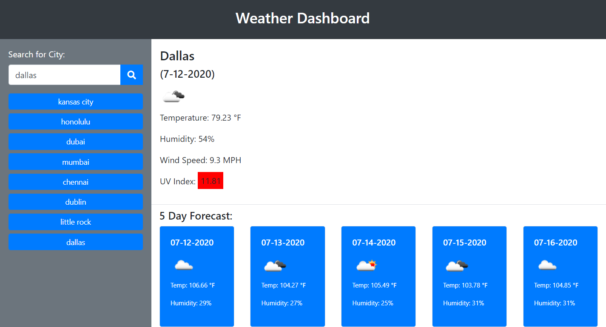

# Weather Dashboard

>This application is a weather dashboard that displays current and forecasted weather conditions for a given city. The user can either enter a city name into the search field or select a city from the history section and the weather will be displayed for current conditions as well as a 5 day forecast. 

[Weather Dashboard](https://jpanakkal22.github.io/weather_dashboard/)

## Table of Contents

* [Installation](#installation)
* [Usage](#usage)
* [License](#license)
* [Badges](#badges)
* [Contributing](#contributing)
* [Tests](#tests)
* [Questions](#questions)

## Installation
No installation needed.

## Usage
This application uses a third party API, OpenWeatherMap API to retrieve weather data for cities. The data that is displayed includes city name, date, an icon representing current weather conditions, temperature, humidity, wind speed and UV index. The UV index is also color coded to show favorable, moderate or severe conditions. Local storage is used to store persistent data. 

## License
None

## Badges
None

## Contributing 
Feel free to contact me using the information in the Questions section.

## Tests
None

## Questions?
[jpanakkal22](https://github.com/jpanakkal22)

